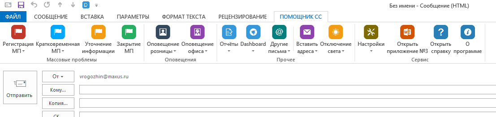

# Помощник старшего специалиста

Помощник СС - это информационная система целью которой является увеличение продуктивности, снижение уровня ошибок старшего специалиста при обработке массовых проблем, рассылке оповещений. Помощник СС позволяет формировать оповещения в “один клик” из заранее заготовленных шаблонов.

* [Интерфейс администратора представлен классическим Windows приложением](https://github.com/V0v1kkk/ConfiguratorForEmailTemplatesAdd-In)
* Клиентская часть представлена надстройкой для Microsoft Outlook 2013 (совместима с Outlook 2016)

 ---
В данном репозитории находятся исходники клиентской части ИС. 

Пример внешнего вида клиентской части сконфигурированной ИС:

### Основные возможности ИС:
* Шаблоны могут быть гибко сконфигурированы
* Интерфейс клиента может быть быстро изменён
* Встроенные макросы (например для вставки текущей даты)
* Возможность быстрой вставки адресов работающих сейчас ТТ
* Поддержка подсказок, которые могут быть заданы в шаблоне
* Контроль над выбором корректного почтового ящика при отправке писем, сформированных из шаблонов

### Особенности системы:
* Разграничение доступа осуществляется предоставлением прав на чтение/запись к папке с рабочей БД (SQLite)
* Клиент автоматически обновляет шаблоны в процессе работы (за исключением структуры интерфейса)
* Максимально облегчённый импорт html-шаблонов писем из Microsoft Outlook или Word
* Шаблоны, и их html-тело – разные сущности
* Возможность массового добавления, замены или удаления адресатов из шаблонов (в разработке)

> Инструкция содежит конфеденциальные сведения, поэтому будет добавлена только после переработки.